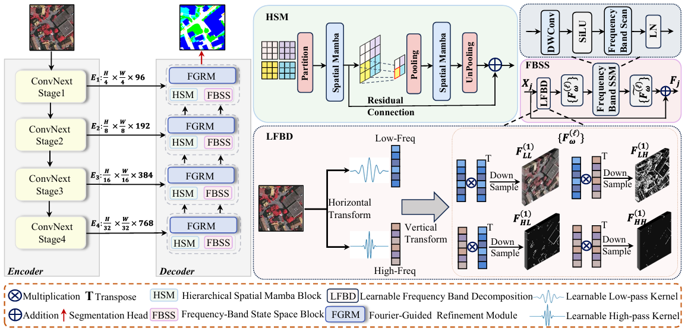

# FBSNet

Official PyTorch implementation of **FBSNet** for remote sensing semantic segmentation.

> **FBSNet: Re-thinking Directional Structure Modeling in Remote Sensing Segmentation via Frequency-Band State Space Networks**

---

## Highlights

- **FBSS**: Frequency-Band State Space module for modeling structured cross-band dependencies from low-frequency context to high-frequency directional details.
- **HSM**: Hierarchical Spatial Mamba block for enhancing large-area geometric continuity and cross-scale spatial consistency.
- **FGRM**: Fourier-Guided Refinement Module for preserving boundary fidelity during progressive decoding.

---

## Framework

<p align="center">
  
</p>


---

## Overview

Remote sensing images contain strong directional structures and multi-frequency cues.  
FBSNet is designed to jointly model:

- **frequency-band dependencies** for directional detail preservation,
- **spatial continuity** for large-area structural consistency,
- **Fourier-guided refinement** for sharper boundary recovery.

The proposed network adopts a **ConvNeXt-based encoder-decoder framework** and introduces three key modules:

- **FBSS**: Frequency-Band State Space
- **HSM**: Hierarchical Spatial Mamba
- **FGRM**: Fourier-Guided Refinement Module


## Repository Structure

```text
FBSNet/
├── README.md
├── config.py
├── models/
│   └── fbsnetbackbone.py
├── modules/
│   ├── fbss.py
│   ├── hsm.py
│   └── fgrm.py
├── assets/
│   └──  framework.png

## Acknowledgement

This repository is built upon PyTorch and partially follows the engineering organization of the open-source **GeoSeg** project.  
We thank the GeoSeg authors for making their code publicly available.

```markdown
## Installation

```bash
# clone repository
git clone https://github.com/liye1213/FBSNet.git
cd FBSNet

# create environment
conda create -n fbsnet python=3.10 -y
conda activate fbsnet

# install dependencies
pip install torch torchvision timm einops opencv-python
pip install mamba-ssm


